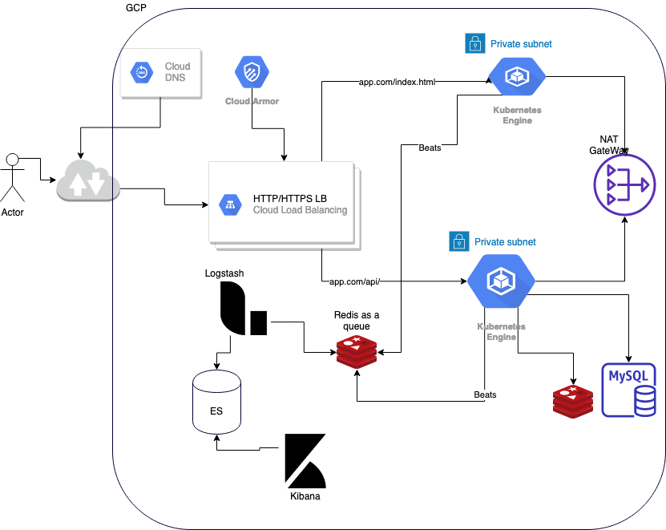

## New Structure 

### Resources
- **Cloud DNS**: DNS with zone for app.com

- **Http/Https LB** : load balancer to redirect the traffic based on the url.
 
- **Private GKE** for serving static web pages.

- **Private GKE** for serving the backend processing.

- **Private subnet** For GKE nodes.

- **NAT GATEWAY** for the nodes to be able to connect to the internet without having public IP.

- **Public Subnet** for the NAT GateWay.

- **Redis** keeps clients connectivity state.

- **MySql** keeps user accounts

- **Beats** ElasticSearch beats it can be any log we want to have.

- **Redis or kafka** as a queue for logs.

- **Logstash** : log stash to store the log to ES cluster.

- **ElasticSearch Cluster** : Cluster to keep the log.

- **Kibana** : for visualization.

### High availability in GKE cluster.

- The cluster can be Multi-zonal clusters, so it will be high available in all the zone in the region. 

- However it's still has the single point of failure as it will have one master node.

- Optional to make the cluster ``Regional clusters``

### Auto Scaling in GKE cluster.

- To make the application Scalable we should enable the GEK cluster autoscaler.

- We can define the min and max nodes required per each cluster. 

### Security

- We will create a private cluster so no one will be able to access it from outside the vpc. 

- All nodes will not have public ip, so we defined A NAT gateway to make the nodes able to connect to the internet.

- LB has Google Cloud Armor(WAF, ip/allow/deny, custom rules) by default we can secure the application from DDoS and targeted web-based attacks. 

- Enable ``Container Analysis`` for performs vulnerability scans for images in Container Registry.

### Provision infrastructure using terraform.

- The structure of my files like the following. 
- ``provider.tf``: contains the provider info with in our case is GCP.
- ``main.tf``: call modules, and data-sources to create all resources.
- ``variables.tf``: contains declarations of variables used in main.tf
- ``outputs.tf``: contains outputs from the resources created in main.tf
- ``locals.tf``: contains the locals values.

### application deployment.

- First step we need to build and package the docker images.

- Push the image to ``Container Registry`` with a specific tag. 

- At this time we can scan the image and decide if we want to release it or not.

- After that we deploy using canary deployment. 

### migration plan to cloud SQL.
